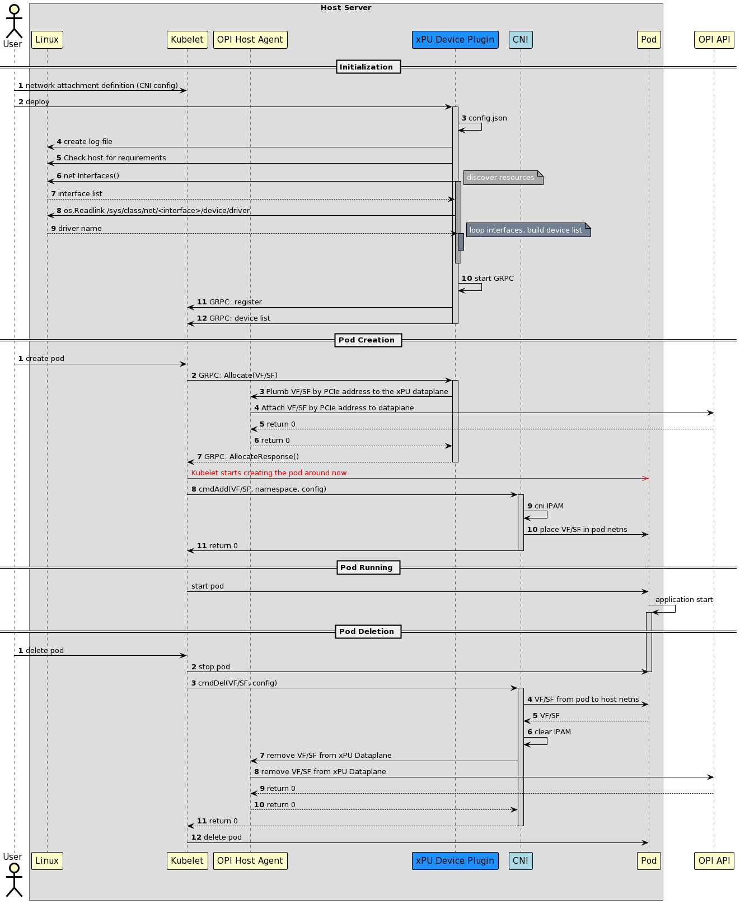

# xPU Device Plugin (DP) provisioning VF

The xPU DP (maybe just SR-IOV DP), provisions and manages a resource pool
of VFs/SFs that can be requested by the Pod.

## Assumptions

- VFs/SFs are uniquely identified by their PCI address. AKA, PCI address is the same on the Host Server as on the xPU.
- DP interacts with the OPI to provision the appropriate VF/SF and not the CNI. The CNI is a simple binary that runs to completion.

## Opens

- Is this even an option we want to consider? rather than just having a CNI-SHIM manage it all. CNI-SHIM means having a CNI control plane involved.

- Should there be an operator in the picture (probably yes doing the CR consolidation and actually the freeing of the VF/SF rather than driving this through the CNI)?

- Should the allocation be driven from the infracluster rather than the tenant?

- Is the VF/SF really the primary/only interface for the Pod? How would this work with something like prometheus today (if it's gathering app metrics). Won't another interface be needed? or is prometheus moving to the DPU?

- Can the CNI even drive the CR deletion?

## Provisioning a VF/SF to a Pod Options

### DP interacts with OPI xPU Agent via CRDs

This would work for either a single cluster or multi-cluster scenario (that is
a tenant and infra cluster). For the multi-cluster scenario, a broker could used
to propagate CRDs across the clusters.

> **_NOTE:_** The device plugin could be wrapped with an Operator.

### DP interacts with OPI Host Agent directly via gRPC

This is not really the K8s way of doing things.

The following diagram shows the host view only, xPU view to be created separately or appended to this diagram.

